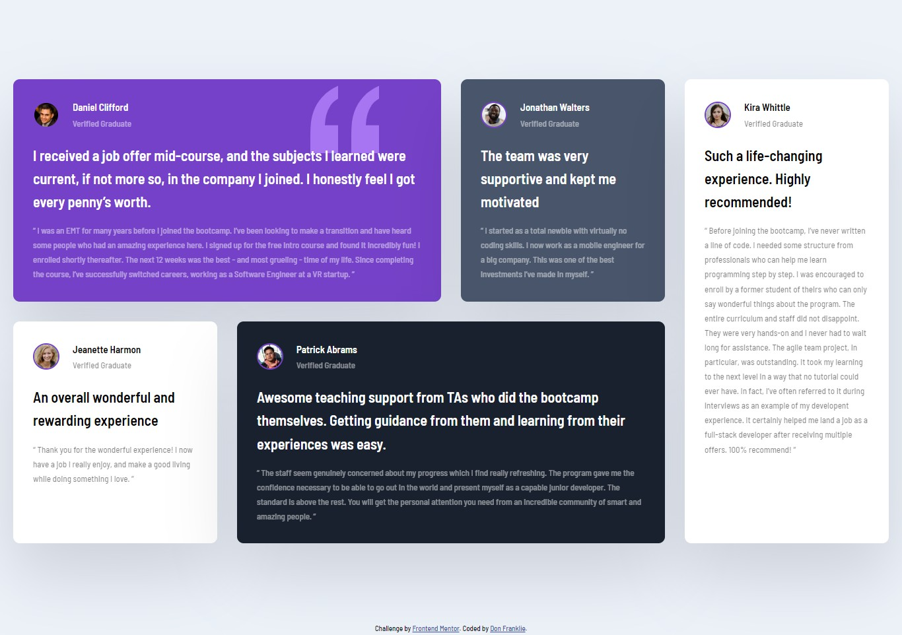

# Frontend Mentor - Testimonials grid section solution

This is a solution to the [Testimonials grid section challenge on Frontend Mentor](https://www.frontendmentor.io/challenges/testimonials-grid-section-Nnw6J7Un7). Frontend Mentor challenges help you improve your coding skills by building realistic projects. 

## Table of contents

- [Overview](#overview)
  - [The challenge](#the-challenge)
  - [Screenshot](#screenshot)
  - [Links](#links)
- [My process](#my-process)
  - [Built with](#built-with)
  - [What I learned](#what-i-learned)
  - [Continued development](#continued-development)
  - [Useful resources](#useful-resources)
- [Author](#author)
- [Acknowledgments](#acknowledgments)


## Overview
- This is a Front-end Mentor challenge called 'Testimonials Grid Section'. It basically requires one to exercise  CSS skills particularly CSS Grid.
- The project put me on an edge of getting to understand more about the CSS Grid layout.

### The challenge

Users should be able to:

- View the optimal layout for the site depending on their device's screen size

### Screenshot




### Links

- Solution URL: [(https://github.com/DonFranklie/Testimonials-Grid-Page)]
- Live Site URL: [Add live site URL here](https://your-live-site-url.com)

## My process
Took me some time to build this page. I had to learn CSS Grid because I had not yet learnt it.

### Built with

- Semantic HTML5 markup
- CSS custom properties
- Flexbox
- CSS Grid
- Desktop-first workflow

### What I learned
This process intrigued me learning media queries and also how to add A  favicon to a Web page

This what I learnt:

```html
<link rel="icon" type="image/png" sizes="32x32" href="./images/favicon-32x32.png">
```
```css 
 @media(min-width: 1024px)
 ```


If you want more help with writing markdown, we'd recommend checking out [The Markdown Guide](https://www.markdownguide.org/) to learn more.


### Continued development

I am going to continue doing as many projects as I can on CSS Grid so as to perfect my Grid skills.
I got a touch of Media Queries and onwards am going to continue practicing about Media Queries.

### Useful resources

- [(https://www.youtube.com/watch?v=0xMQfnTU6oo&t=11s)] - This helped me to understand more about Grid. I really liked this pattern and will use it going forward.
- [(https://www.csstricks.com)] - This is an amazing site that  helped me finally understand Grid. I'd recommend it to anyone still learning this concept.

## Author

- Frontend Mentor - [@DonFranklie](https://www.frontendmentor.io/profile/donfranklie)
- Twitter - [@donfranklie](https://www.twitter.com/donfranklie)


## Acknowledgments

Much thanks to Brad Traversy of Traversy Media. He gave me the Inspiration to take on this challenge since I got know about FrontEnd Mentor through him. Much thanks Brad

It was after learning about CSS Grid form Brad That I got the energy and Knowledge to complete this challenge. He equipped me with the required Knowledge.
